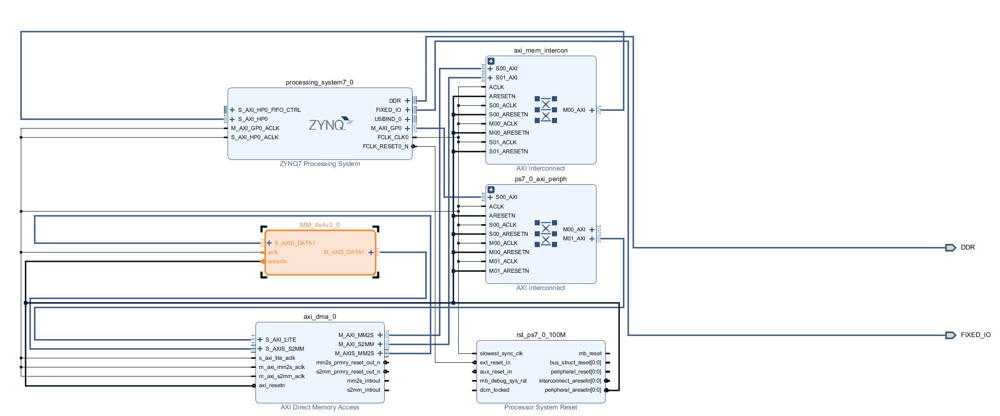
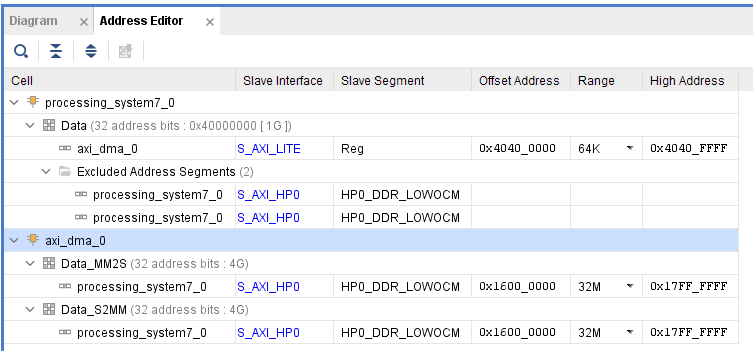

# Accelerator Setup on PYNQ board

This guide will show how to prepare the accelerator in Vitis to be used on the PYNQ board through AXI4MLIR. 

# Prerequisites

- [Vitis 2020.2](https://www.xilinx.com/support/download/index.html/content/xilinx/en/downloadNav/vitis/2020-2.html)
- [PYNQ-Z2 board](https://www.tul.com.tw/productspynq-z2.html)

# Steps

1. Follow the steps to design the accelerator in VitisHLS.
  - The accelerator must include an AXI4-Stream interface, thus it requires the following pragma directive in the C++ code similar to [accelv3](https://github.com/AXI4MLIR/llvm-project/blob/f2172866a5c47516dd4f4b823c7a75c96821f6f7/mlir/include/mlir/ExecutionEngine/axi/accelerators/mm_4x4_v3/accelerator.sc.h#L116):
    ```c++
    #pragma HLS RESOURCE variable=din1 core=AXI4Stream metadata="-bus_bundle S_AXIS_DATA1" port_map={{din1_0 TDATA} {din1_1 TLAST}}
    #pragma HLS RESOURCE variable=dout1 core=AXI4Stream metadata="-bus_bundle M_AXIS_DATA1" port_map={{dout1_0 TDATA} {dout1_1 TLAST}}
    #pragma HLS RESET variable=reset
    ```
2. Export the accelerator as an IP.
3. Create a new Vitis project.
4. Add the IP to the project.
5. Connect the IP to the system following in a similar manner to the following:
  
6. Setup the address map for the IP.
  - The address map can be found in the Address Editor tab in the Block Design.
  - The address map should be similar to the following:
  
  - **Take note of the selected DMA addresses**. These are going to be used in AXI4MLIR
6. Generate the bitstream.
8. Copy bitstream and [bitstream loader script](../experiments/ex1/ex1_pynq/load_bitstream.py) to the PYNQ board.